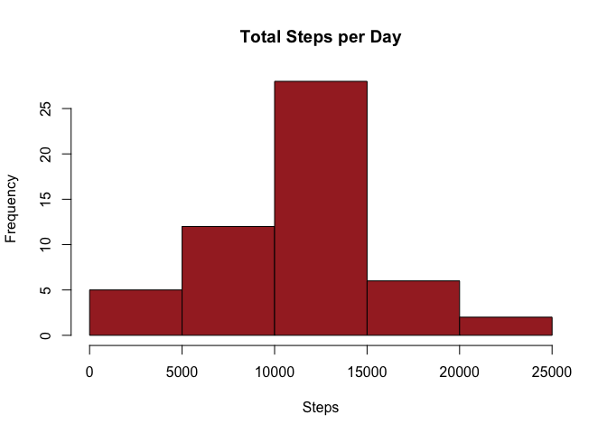

## Loading and preprocessing the data

```r
library(data.table)
library(lubridate)

#read data, and 
activity <- read.csv("activity.csv", header = TRUE)
activity = na.omit(activity)
activity <- data.table(activity)
activity$date <- ymd(activity$date)
```

## What is mean total number of steps taken per day?


```r
# group by date and sum the steps
agg <- aggregate(steps ~ date, activity, sum)
hist(agg$steps, main = "Total Steps per Day", col = "brown", xlab = "Steps")
```

<!-- -->

```r
# mean and median
meanSteps <- mean(agg$steps, na.rm = TRUE)
medSteps <- median(agg$steps, na.rm = TRUE)
```
The mean of the total number of steps is **10766.1886792453**.  
The median of the total number of steps is **10765**.


## What is the average daily activity pattern?


## Imputing missing values


## Are there differences in activity patterns between weekdays and weekends?
