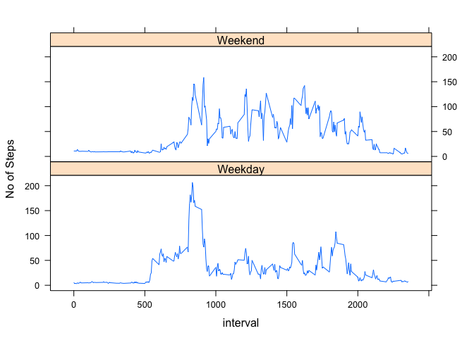

## Loading and preprocessing the data

```r
library(data.table)
library(lubridate)

#read data, and 
activity <- read.csv("activity.csv", header = TRUE)
activity_no_na = na.omit(activity)
activity_no_na <- data.table(activity_no_na)
activity_no_na$date <- ymd(activity_no_na$date)
```

## What is mean total number of steps taken per day?


```r
# group by date and sum the steps
agg <- aggregate(steps ~ date, activity_no_na, sum)
hist(agg$steps, main = "Total Steps per Day", col = "brown", xlab = "Steps")
```

<!-- -->

# Mean and Median

```r
meanSteps <- mean(agg$steps, na.rm = TRUE)
medSteps <- median(agg$steps, na.rm = TRUE)
```
The mean of the total number of steps is **10766.1886792453**.  
The median of the total number of steps is **10765**.


## What is the average daily activity pattern?

```r
avgSteps <- aggregate(steps ~ interval, activity_no_na, mean)
plot(avgSteps$interval, avgSteps$steps, type = "l", xlab = "Interval", ylab = "Average Steps", 
     main = "Average Daily Activity", col = "brown")
```

<!-- -->

```r
# max # of avg steps
maxSteps <- max(avgSteps$steps)
maxSteps <- format(round(maxSteps, 2), nsmall = 2)
maxInterval <- subset(avgSteps, steps == max(steps))$interval
```
The interval **835** contains the maximum number of steps **206.17**.

## Imputing missing values

```r
# calculate number of NAs
naRows <- subset(activity, is.na(activity))
completeRows <- subset(activity, !is.na(activity))

naCount <- nrow(naRows)

merged <- merge(naRows, avgSteps, by = "interval")
naRows$steps <- merged$steps.y
final <- rbind(naRows, completeRows)
finalAgg <- aggregate(steps ~ date, final, sum)
hist(finalAgg$steps, main = "Total Steps per Day w/ Imputed Values", col = "red", xlab = "Steps")
```

<!-- -->

```r
# mean and median
meanFinalSteps <- mean(finalAgg$steps)
meanFinalSteps <- format(round(meanFinalSteps, 2), nsmall = 2)
medFinalSteps <- median(finalAgg$steps)
medFinalSteps <- format(round(medFinalSteps, 2), nsmall = 2)
```

There are **2304** missing values.  
The mean for the dataset with imputed values is **10766.19**.  
The median for the dataset with imputed values is **11015.00**.  
The mean of the complete is the same as the mean for the dataset without missing values. The median is almost the same, with a difference of 250.

## Are there differences in activity patterns between weekdays and weekends?


```r
library(lubridate)
```

```
## 
## Attaching package: 'lubridate'
```

```
## The following object is masked from 'package:base':
## 
##     date
```

```r
library(lattice)

# add the weekday
final$weekday <- as.factor(weekdays(ymd(final$date)))
final$is_weekday <- !(final$weekday == "Saturday" | final$weekday == "Sunday")

finalWeekday <- subset(final, is_weekday == TRUE)
finalWeekend <- subset(final, is_weekday == FALSE)

# aggregate and sum
finalWeekdayAgg <- aggregate(steps ~ interval, finalWeekday, mean)
finalWeekendAgg <- aggregate(steps ~ interval, finalWeekend, mean)

# union the two datatasets and and a day column
finalWeekdayAgg$day <- "Weekday"
finalWeekendAgg$day <- "Weekend"
finalData <- rbind(finalWeekdayAgg, finalWeekendAgg)

# panel plot
panel <- xyplot(steps ~  interval | day, data = finalData, layout = c(1,2), type ="l", ylab="No of Steps")
print(panel)
```

<!-- -->
